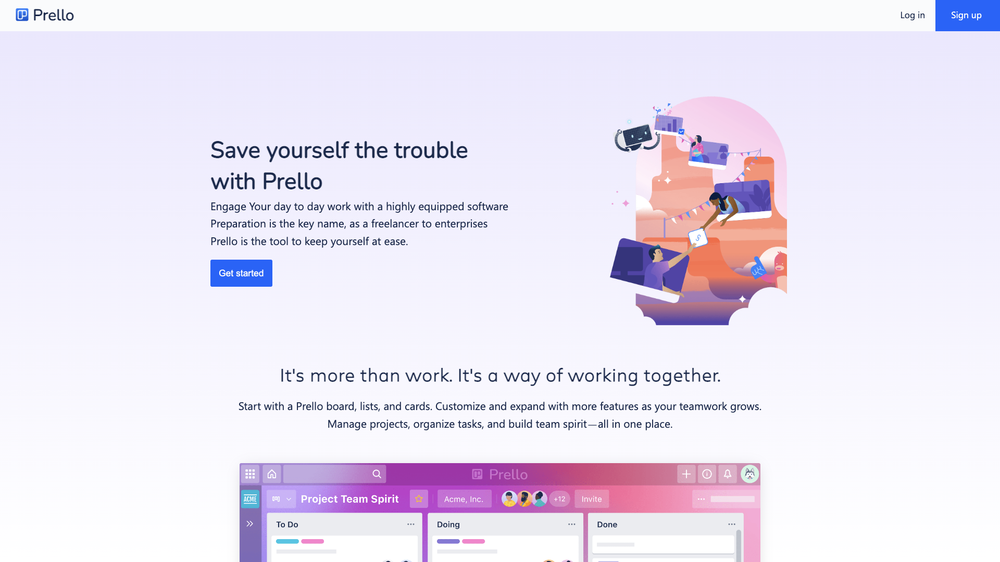
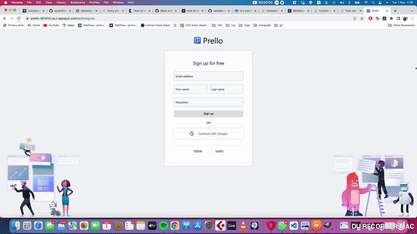
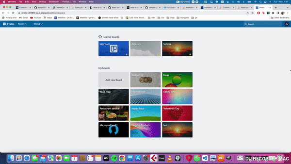
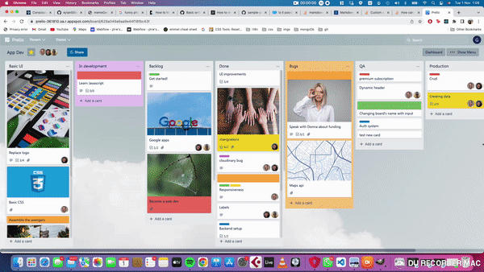
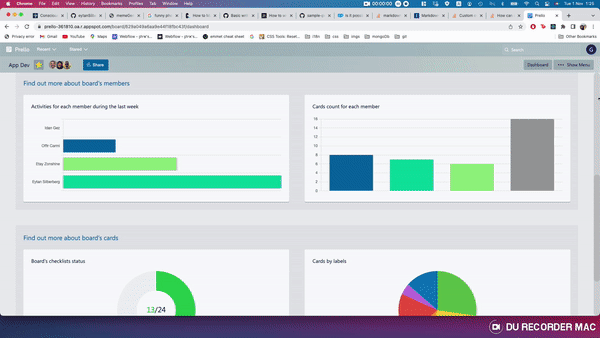
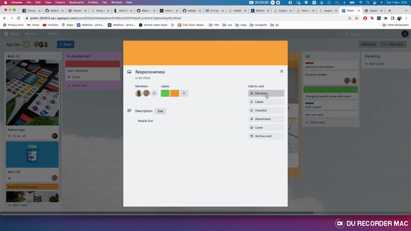
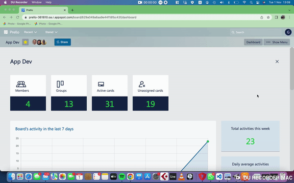
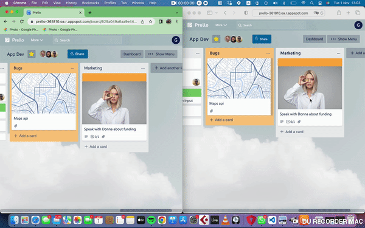

# Prello
<br/>



## view on

git clone: https://github.com/Itay1010/Prello.git

<br/>
visit at: https://prello-361810.oa.r.appspot.com/

<hr/>

<br/>

Hi there! and welcome to our Prello app! 
<br/>
A task manager app built to serve both small and large companies. This app is a fullstack app that was inspired by the Trello application and website.
Creators of the project are: Etay zonshine, Offir Carmi and Eytan Silberberg. This project was given to us through Coding Academy- March 22 bootcamp

<ins>Stack:</ins>

**Front:** React, Redux, Thunk
<br/>

**Back:** Node.js, express, MongoDB

Libraries and style languages used in this app are:
- mui
- chart.js
- formik
- get-average-color
- gapi
- react-beautiful-dnd
- react-facebook-login
- react-google-login
- tinycolor2
- sass

This app includes a number of routes:
- Home page
- Login
- Workspace
- Board page
  - Task preview
  - Dashboard

The app can be used on all screen sizes

<p float=left>
    
    
    
</p>

<p float='left'>
    
    
</p>

## Board and Task details page

Features we'll be going through in this next video are:
- **Drag and drop** - Theoption of dragging and dropping list and cards from one place to another.
- Adding new assignment
- **Marking an assignment as done** - As you get progress with your assignments you can drag and drop an entire list  or card by card where ever you please. Additionally you have the option to mark a specific task in a specific task as active or not by checking to checkmark. 


Other features:

- Adding tasks to a general task
- Adding members to tasks
- Adding images to tasks
- Adding labels to tasks



## Dashboard

In this page(which is an inner route) you'll be able to keep tabs on all people related to a specific board, and the board assignments progress.
In this dashboard you'll get your the relevant data presented to you in charts, so it is easy to understand.



## SocketIo

SocketIo is an event driven library which allows users to see real live events on different devices at the same time. In this video you're able to see how two different browsers have the knowledge of an action when the other creates an event. 



## Code quote

This code quote is from the board page component.
This function knows how to sample the average color the boards background(regardless if the background is an image or a color), and with the result we get we are able to set a new color for the header of the page, so it will always stays visible.

This function uses a util function set in the util.service file.

```js
setTheme = async () => {
        const boardStyle = this.props.board.style || null
        if (boardStyle?.backgroundColor) {
            const isDark = tinycolor(boardStyle.backgroundColor).isDark()
            utilService.setDynamicColors(isDark, boardStyle.backgroundColor)
            document.querySelector('#root').style.backgroundColor = boardStyle.backgroundColor
        }
        if (boardStyle?.background) {
            const avgColor = await boardService.calcAvgColor(boardStyle.background)
            const isDark = tinycolor(avgColor).isDark()
            utilService.setDynamicColors(isDark, avgColor)
            document.querySelector('#root').style.background = `url(${boardStyle.background})`
        }
    }

  ```


Links to our pages:

Etay Zonshine: https://github.com/Itay1010

Offir Carmi: https://github.com/OffirCarmi


Eytan Silberberg: https://github.com/eytanSilberberg

Hope you enjoy the experience of using our app.


